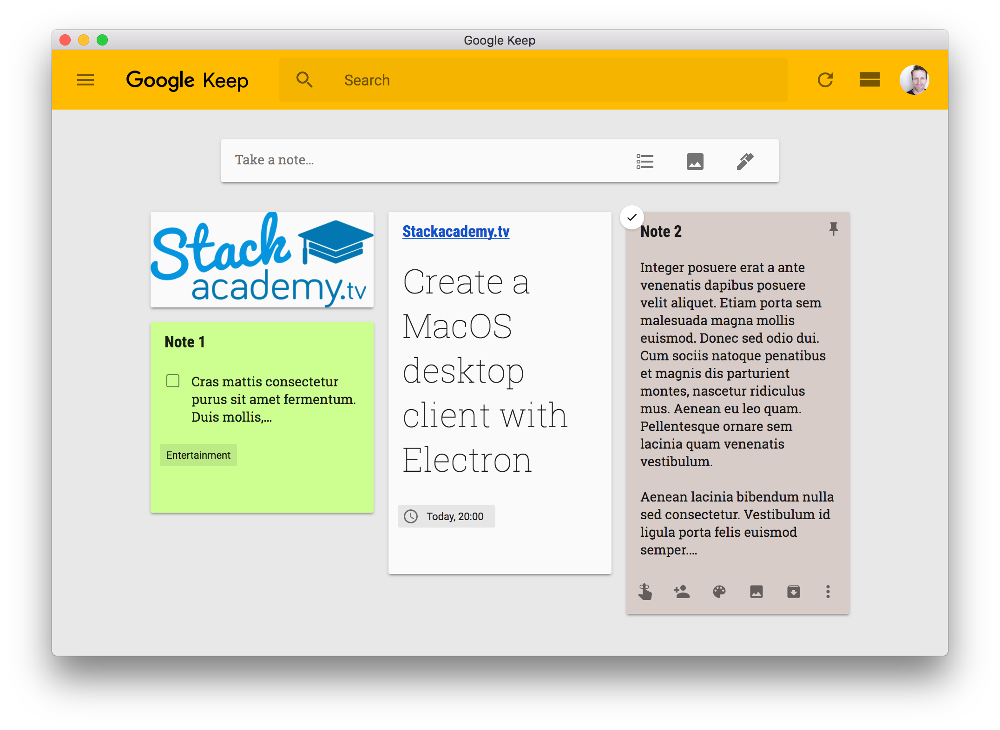

# Google Keep for MacOS

A very unofficial **Google Keep** desktop app for MacOS.

- Persistent window sate
- Native app menu and context menus
- Full spelling and grammer support

## [Download the latest release](https://github.com/stackacademytv/Google-Keep-Mac/releases/download/v1.2.2/Google.Keep-1.2.2.dmg)

***Any feature requests welcome!***

### PS: If you're interested in learning to develop Electron Applications for Mac, Windows and Linux, be sure to [check out my Electron Course](https://www.udemy.com/master-electron/?couponCode=ELECTRON_GH). *(Coupon already applied)*
